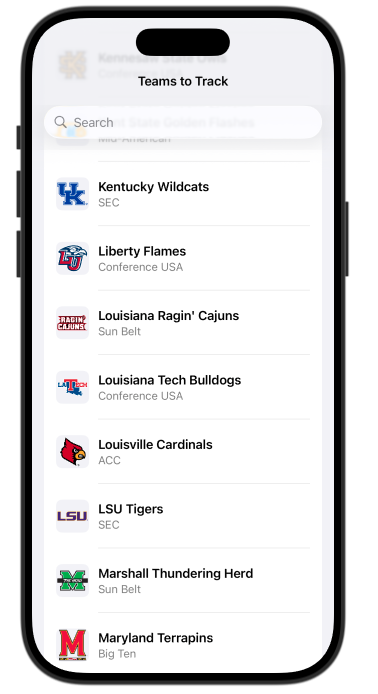

# Hate Watch iOS

> SwiftUI app to allow users to experience the joy of watching their most hated teams lose.

## 🚧 Status
⚠️ Work in progress. Currently focusing on the supporting data pipeline and model

## Goals
- [ ] Create simple design previews and add them to the README
- [ ] Allow users to select the teams they want to hate watch
- [ ] Fetch predictions from `cfb-ats-api` to let users know whether the model thinks the team will cover
- [ ] Display list of weekly games for all hated teams with spreads, predictions, and probabilities.
- [ ] Allow users to drill in to see some of what the model is considering

## Planned Structure
cfb-ats-ios/
CFBATS/
ContentView.swift
Models/
Services/
Views/
ViewModels/

## Tech
- Swift 5, SwiftUI
- URLSession (async/await)
- Codable structs for API schemas

## Next Steps
- [ ] Create mocked views to iterate on user experience
- [ ] Add mock API client

## Mocked Views
Selecting teams you want to track:

